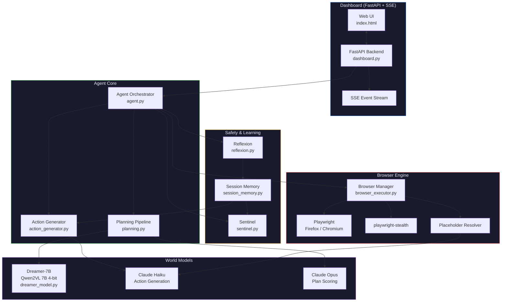
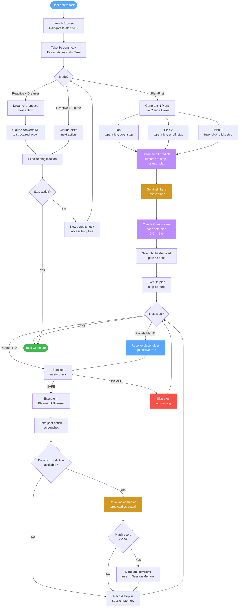
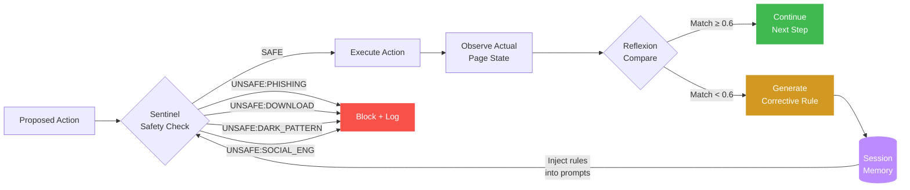

# WebDreamer Agent — Mermaid Diagrams

## 1. System Architecture Diagram

```mermaid
graph TB
    subgraph UI["Dashboard (FastAPI + SSE)"]
        WEB[Web UI<br/>index.html]
        API[FastAPI Backend<br/>dashboard.py]
        SSE[SSE Event Stream]
        WEB <--> API
        API --> SSE
    end

    subgraph CORE["Agent Core"]
        AGENT[Agent Orchestrator<br/>agent.py]
        AG[Action Generator<br/>action_generator.py]
        PLAN[Planning Pipeline<br/>planning.py]
    end

    subgraph MODELS["World Models"]
        DREAMER[Dreamer-7B<br/>Qwen2VL 7B 4-bit<br/>dreamer_model.py]
        CLAUDE_H[Claude Haiku<br/>Action Generation]
        CLAUDE_O[Claude Opus<br/>Plan Scoring]
    end

    subgraph SAFETY["Safety & Learning"]
        SENTINEL[Sentinel<br/>sentinel.py]
        REFLEX[Reflexion<br/>reflexion.py]
        MEMORY[Session Memory<br/>session_memory.py]
    end

    subgraph BROWSER["Browser Engine"]
        BM[Browser Manager<br/>browser_executor.py]
        PW[Playwright<br/>Firefox / Chromium]
        STEALTH[playwright-stealth]
        RESOLVER[Placeholder Resolver]
    end

    API --> AGENT
    AGENT --> AG
    AGENT --> PLAN
    AG --> CLAUDE_H
    PLAN --> CLAUDE_O
    PLAN --> DREAMER
    AGENT --> SENTINEL
    AGENT --> REFLEX
    REFLEX --> MEMORY
    MEMORY --> SENTINEL
    MEMORY --> AG
    AGENT --> BM
    BM --> PW
    BM --> STEALTH
    BM --> RESOLVER
    RESOLVER --> CLAUDE_H

    style UI fill:#1a1a2e,stroke:#58a6ff,color:#e6edf3
    style CORE fill:#1a1a2e,stroke:#3fb950,color:#e6edf3
    style MODELS fill:#1a1a2e,stroke:#bc8cff,color:#e6edf3
    style SAFETY fill:#1a1a2e,stroke:#d29922,color:#e6edf3
    style BROWSER fill:#1a1a2e,stroke:#f85149,color:#e6edf3
```

---

## 2. End-to-End Flowchart — Plan-First Mode

```mermaid
flowchart TD
    START([User enters task]) --> LAUNCH[Launch Browser<br/>Navigate to start URL]
    LAUNCH --> SCREENSHOT[Take Screenshot +<br/>Extract Accessibility Tree]
    SCREENSHOT --> MODE{Mode?}

    MODE -->|Plan-First| GEN_PLANS[Generate N Plans<br/>via Claude Haiku]
    MODE -->|Reactive + Dreamer| DREAMER_ACT[Dreamer proposes<br/>next action]
    MODE -->|Reactive + Claude| CLAUDE_ACT[Claude picks<br/>next action]

    %% Plan-First Branch
    GEN_PLANS --> PLAN1[Plan 1<br/>type, click, type, stop]
    GEN_PLANS --> PLAN2[Plan 2<br/>type, click, scroll, stop]
    GEN_PLANS --> PLAN3[Plan 3<br/>type, click, click, stop]

    PLAN1 --> DREAMER_PRED[Dreamer-7B predicts<br/>outcome of step 1<br/>for each plan]
    PLAN2 --> DREAMER_PRED
    PLAN3 --> DREAMER_PRED

    DREAMER_PRED --> SENTINEL_FILTER[Sentinel filters<br/>unsafe plans]

    SENTINEL_FILTER --> SCORE[Claude Opus scores<br/>each safe plan<br/>0.0 — 1.0]

    SCORE --> SELECT[Select highest-scored<br/>plan as best]

    SELECT --> EXEC_LOOP[Execute plan<br/>step by step]

    %% Reactive Dreamer Branch
    DREAMER_ACT --> CONVERT[Claude converts NL<br/>to structured action]
    CONVERT --> EXEC_SINGLE

    %% Reactive Claude Branch
    CLAUDE_ACT --> EXEC_SINGLE[Execute single action]

    %% Execution
    EXEC_LOOP --> STEP{Next step?}
    EXEC_SINGLE --> STEP_REACT{Stop action?}

    STEP -->|Placeholder ID| RESOLVE[Resolve placeholder<br/>against live tree]
    STEP -->|Numeric ID| PRE_CHECK
    STEP -->|stop| DONE

    RESOLVE --> PRE_CHECK[Sentinel<br/>safety check]

    PRE_CHECK -->|SAFE| EXECUTE[Execute in<br/>Playwright Browser]
    PRE_CHECK -->|UNSAFE| BLOCKED[Skip step<br/>log warning]

    EXECUTE --> POST_SCREEN[Take post-action<br/>screenshot]

    POST_SCREEN --> HAS_PRED{Dreamer prediction<br/>available?}

    HAS_PRED -->|Yes| REFLEXION[Reflexion compares<br/>predicted vs actual]
    HAS_PRED -->|No| RECORD

    REFLEXION --> MISMATCH{Match score<br/>< 0.6?}
    MISMATCH -->|Yes| LEARN[Generate corrective<br/>rule → Session Memory]
    MISMATCH -->|No| RECORD

    LEARN --> RECORD[Record step in<br/>Session Memory]
    RECORD --> STEP

    BLOCKED --> STEP

    STEP_REACT -->|Yes| DONE
    STEP_REACT -->|No| NEW_SCREEN[New screenshot +<br/>accessibility tree]
    NEW_SCREEN --> MODE

    DONE([Task Complete])

    style START fill:#58a6ff,stroke:#58a6ff,color:#fff
    style DONE fill:#3fb950,stroke:#3fb950,color:#fff
    style BLOCKED fill:#f85149,stroke:#f85149,color:#fff
    style DREAMER_PRED fill:#bc8cff,stroke:#bc8cff,color:#fff
    style SENTINEL_FILTER fill:#d29922,stroke:#d29922,color:#fff
    style REFLEXION fill:#d29922,stroke:#d29922,color:#fff
    style SCORE fill:#bc8cff,stroke:#bc8cff,color:#fff
    style RESOLVE fill:#58a6ff,stroke:#58a6ff,color:#fff
```

---

## 3. Sentinel + Reflexion Safety Loop (Detail)

```mermaid
flowchart LR
    ACTION[Proposed Action] --> SENTINEL{Sentinel<br/>Safety Check}

    SENTINEL -->|SAFE| EXEC[Execute Action]
    SENTINEL -->|UNSAFE:PHISHING| BLOCK[Block + Log]
    SENTINEL -->|UNSAFE:DOWNLOAD| BLOCK
    SENTINEL -->|UNSAFE:DARK_PATTERN| BLOCK
    SENTINEL -->|UNSAFE:SOCIAL_ENG| BLOCK

    EXEC --> ACTUAL[Observe Actual<br/>Page State]
    ACTUAL --> REFLEX{Reflexion<br/>Compare}

    REFLEX -->|Match ≥ 0.6| OK[Continue<br/>Next Step]
    REFLEX -->|Match < 0.6| RULE[Generate<br/>Corrective Rule]

    RULE --> MEM[(Session<br/>Memory)]
    MEM -->|Inject rules<br/>into prompts| SENTINEL

    style BLOCK fill:#f85149,stroke:#f85149,color:#fff
    style OK fill:#3fb950,stroke:#3fb950,color:#fff
    style RULE fill:#d29922,stroke:#d29922,color:#fff
    style MEM fill:#bc8cff,stroke:#bc8cff,color:#fff
```
